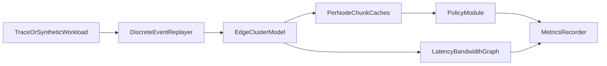

# Research Plan — submission draft

**Course logistics (mirror anywhere the template asks):** Research Plan due **May 15, 2026** (5% of final grade). Presentation file upload **April 29, 2026, 8:30 AM**. End-term **May 15, 2026, 10:30 AM**. This project is **not** overlapping CS 297/298 work. If working in a pair, **each member uploads the same** presentation and final PPT where required.

Copy sections below into the instructor’s Word/Google template using [CANVAS_TEMPLATE_MAPPING.md](CANVAS_TEMPLATE_MAPPING.md). Full citations: [REFERENCES.md](REFERENCES.md). Frozen scope: [SCOPE_LOCK.md](SCOPE_LOCK.md).

---

## 1. Title, category, team, platform

**Title:** p99-Aware Collaborative Chunk Caching for Short-Video Delivery in Wireless Edge Networks  

**Category:** Category 2 — Simulation Project (imitate an established collaborative edge-caching model; add a new **evaluation objective** and **tail-aware** policy in simulation).

**Team:** [Student name]; partner (if any): [name].

**Platform:** Apple macOS laptop; discrete-event simulation in **Rust**; results as CSV and plots. No radio testbed required for the core project.

---

## 2. Abstract (150–250 words; trim to template limit)

Wireless edge networks increasingly use **cooperative caches** at access points or small-cell sites to reduce backhaul load and delivery delay. The CLoSER framework demonstrates strong gains for **video playout delay** using **local content sharing** among small-cell base stations with trace-driven evaluation. However, many caching studies emphasise **mean** delay, **hit ratio**, or **aggregate cost**, while **high-percentile startup delay** (tail latency) strongly affects perceived quality for **short-form video**, especially under **bursty** demand.

This project builds a **discrete-event simulator** (Rust) for a cluster of edge caches over an abstract **latency/bandwidth graph**. Content is modelled at **chunk** granularity so that **startup** is tied to availability of the **first chunk**. We reproduce **LRU**, **LFU/popularity**, and a **CLoSER-like collaborative** baseline (nearest-neighbour fetch, then origin). We then propose a **p99-aware** collaborative replacement policy using a rolling-window score that trades predicted hit benefit against **empirical tail startup delay** and **remote bytes**, with optional **popularity forecast error**.

Experiments sweep **cache budget**, **link heterogeneity**, **burstiness**, and **prediction noise**, reporting **p95/p99 startup delay** (primary), mean delay, hit ratio, remote traffic, and **Jain fairness**. The expected contribution is evidence on whether **tail-aware** collaborative chunk caching improves worst-case experience without sacrificing average metrics beyond an acceptable margin.

---

## 3. Problem statement

Edge-assisted delivery must support **skewed**, **burst-prone** short-video workloads. Cooperative caching improves averages, but **worst-case** startup delays drive user dissatisfaction during popularity shifts and cache churn. It is unclear **when** a simple tail-aware heuristic materially improves **p99** versus strong collaborative baselines that do not optimise tails.

---

## 4. Motivation and relevance

- **Networking:** caching, inter-edge transfers, origin fallback, and congestion-aware delay are core **networked systems** problems.  
- **Edge / MEC context:** multi-access edge computing and traffic localisation motivate policy-driven caching (standards cited in [REFERENCES.md](REFERENCES.md) as background only).  
- **Workload:** short videos combine **high churn** and **concentrated** popularity—stressing policies that only track means.

---

## 5. Base paper and imitation boundary

**Primary anchor:** Mahboob *et al.*, **CLoSER**, *Computer Networks*, 2023 [1]: collaborative small-cell caching with **local sharing**, evaluated with realistic request patterns; focuses on **playout delay** and bandwidth.

**Imitation:** multi-edge topology, **local** vs **remote** fetch paths, finite caches, trace-like or synthetic workload.

**Non-goals:** exact reproduction of CLoSER’s full optimisation proof/solver; **no** full PHY or 3GPP call control.

**Supporting context:** Niu *et al.*, short-video edge caching (DECC), *Scientific Reports*, 2025 [2]; Wan *et al.*, PRIME proactive MEC caching, *CMES*, 2024 [3]; optional Shi *et al.*, COCAM, *Journal of Cloud Computing*, 2023 [4].

---

## 6. Research gap

Collaborative and predictive edge caching papers often report **mean** delay and **hit ratio**. There is limited **controlled** comparison of **chunk-level** policies that **explicitly target p95/p99 startup** under **bursts** and **forecast error**, using **transparent heuristics** suitable for a semester simulator.

---

## 7. Proposed contribution

1. **Chunk-level model** — startup latency depends on **first-chunk** placement and fetch path (local, neighbour, origin).  
2. **p99-aware policy** — periodic scoring over window \(W\) using observed delays; replacement maximises  
   \(\alpha \hat{H} - \beta \widehat{\mathrm{p99}}_{\mathrm{startup}} - \gamma\, \mathrm{remote\_bytes}\)  
   with small \((\alpha,\beta,\gamma)\) grid in experiments; fairness tie-break (e.g., reduce max per-user tail penalty).  
3. **Robustness** — inject noise or a **step change** in popularity; compare static prediction vs rolling estimate vs tail-aware policy.

---

## 8. Objectives

1. Survey collaborative wireless edge caching for video.  
2. Implement a **Rust DES** for multi-edge chunk caching with local sharing and origin.  
3. Implement **four policies** per [SCOPE_LOCK.md](SCOPE_LOCK.md).  
4. Quantify **p95/p99** vs baselines across four independent variables.  
5. Deliver a **demo** (CDF or rolling p99) and a **final** slide deck incorporating instructor feedback.

---

## 9. Methodology

- **Discrete-event simulation:** `request_arrival`, `local_hit`, `neighbor_fetch_*`, `origin_fetch_*`, `cache_admit/evict`.  
- **Network:** graph of edges with latency and bandwidth; transfer time from serialization + propagation (no PHY).  
- **Routing on miss:** try attached cache → **shortest-time neighbour** with chunk → **origin**.  
- **Outputs:** CSV logs; figures (Python or Rust plotters).

Architecture (for the written plan or figure slide):

---

## 10. Evaluation plan

- **Independent variables:** cache budget; backhaul heterogeneity; burstiness; prediction error ([SCOPE_LOCK.md](SCOPE_LOCK.md)).  
- **Primary metrics:** p95 and **p99 startup delay**.  
- **Secondary:** mean startup, hit ratio, remote bytes, Jain fairness on per-user means.  
- **Hypothesis example:** Under fixed burstiness \(b\), p99-aware policy lowers p99 by \(\geq 10\%\) vs CLoSER-like baseline without reducing hit rate by more than \(Y\%\) (to be measured).  
- **Reproducibility:** fixed seeds; versioned configs; documented run command.

---

## 11. Demo (presentation + laptop)

- Same trace, two policies: show **CDF of startup delay** or **rolling p99**.  
- Hero figure: **p99 vs cache size** for four policies.  
- Ablations (backup): remove tail term; file-level vs chunk-level; no cooperation.

---

## 12. Tools

Rust; optional Tokio if concurrent I/O is added later; serde for configs; CSV export. macOS only is sufficient.

---

## 13. Timeline (Apr 16 – May 15, 2026)

| Window | Milestone |
|--------|-----------|
| Apr 16–24 | Literature notes; DES skeleton; LRU/LFU; first metrics + plots |
| **Apr 29** | **Upload presentation**; include architecture + expected results |
| Apr 30 – May 10 | CLoSER-like + p99-aware; sweeps + ablations |
| May 11–14 | Incorporate feedback; polish figures |
| **May 15** | **Submit research plan** (if not already) + **final PPT** per course portal; end-term exam |

---

## 14. Risks and mitigations

- **Noisy tail metrics** → many seeds; report confidence intervals.  
- **Heuristic criticism** → document measurable quantities and pseudocode.  
- **Scope creep** → no DRL until baselines done.

---

## 15. Expected outcomes

A reproducible simulator; quantitative comparison showing **when** tail-aware collaborative chunk caching helps; clear limitations (synthetic-first workload, abstract network).

---

## 16. References

See [REFERENCES.md](REFERENCES.md) for formatted entries [1]–[8].
